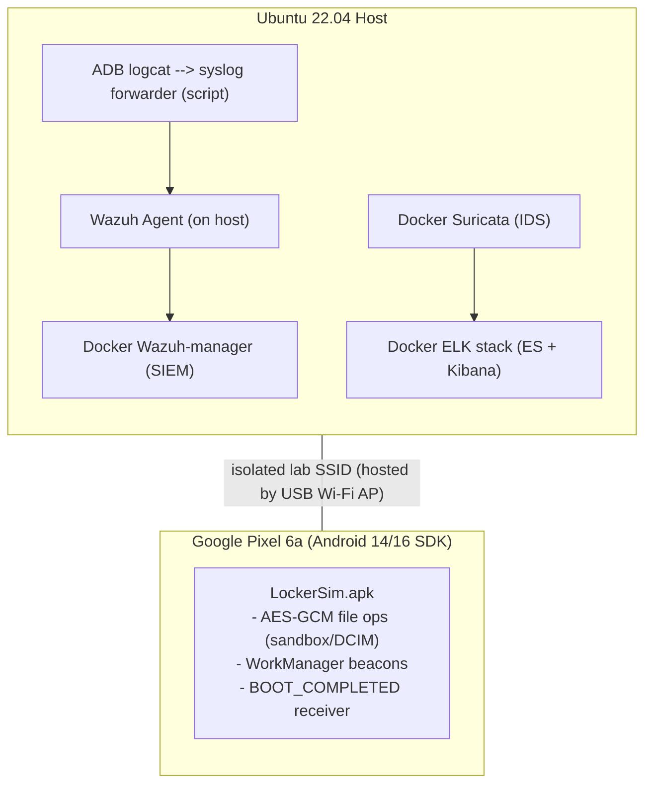

# eth‑red‑blue — Mobile Ransomware Red/Blue Lab

> **Elevator pitch**  
> A complete, reproducible red/blue lab that simulates a mobile ransomware campaign against a **physical Google Pixel 6a** on an **isolated Wi‑Fi AP**.  
> The **Red Team** delivers and sideloads a lab APK (“LockerSim”) that encrypts a **scoped** photo folder and sends benign JSON beacons.  
> The **Blue Team** ingests **Suricata EVE** and **ADB logcat --> Wazuh**, engineers detections (D1/N1/W1–W5), and correlates _boot --> first beacon_ in Elastic Security.  
> Everything you need to **re‑run the exercise end‑to‑end**—code, rules, KQL/EQL, and helper scripts—is in this repo.

---

## Contents

- [Introduction](#introduction)
- [High‑level architecture](#high-level-architecture)
- [Environment & setup](#environment--setup)
  - [Host prerequisites](#host-prerequisites)
  - [Clone & compose](#clone--compose)
  - [Suricata tuning](#suricata-tuning)
  - [Wazuh ingest (ADB logcat --> syslog)](#wazuh-ingest-adb-logcat--syslog)
  - [Android app (LockerSim)](#android-app-lockersim)
  - [Lab HTTP service for delivery / beacons](#lab-http-service-for-delivery--beacons)
- [Detection engineering](#detection-engineering)
  - [Suricata rules (network)](#suricata-rules-network)
  - [Kibana KQL hunts (saved searches)](#kibana-kql-hunts-saved-searches)
  - [Wazuh rules (handset logs)](#wazuh-rules-handset-logs)
  - [Elastic Security correlation (EQL)](#elastic-security-correlation-eql)
- [Run the full validation flow](#run-the-full-validation-flow)
- [Evidence pack layout](#evidence-pack-layout)
- [Repo structure (excerpt)](#repo-structure-excerpt)
- [Tools list](#tools-list)
  - [Red team](#red-team)
  - [Blue team](#blue-team)
- [Safety & ethics](#safety--ethics)
- [Acknowledgements](#acknowledgements)

---

## Introduction

This lab demonstrates a realistic mobile ransomware chain—delivery, sideload/exploitation, installation/persistence, C2, and actions‑on‑objective—against the author’s **own** Pixel 6a on a dedicated lab SSID. The Blue Team side implements network and handset telemetry, custom detections, and a time‑bound correlation linking **BOOT_COMPLETED --> first beacon**. All detections are designed to be **auditable** (JSON/PCAP/Kibana exports) and are scoped to keep the exercise ethical and safe (no exfiltration; file encryption limited to an app‑private directory or a user‑granted tree).

---

## High‑level architecture



---

## Environment & setup

### Host prerequisites

- Ubuntu **22.04 LTS** (or similar Linux host).
- **Docker** + **Docker Compose**.
- **ADB / Android Platform Tools** on the host.
- **Python 3.10+** (for tiny utility scripts).
- A dual‑band USB Wi‑Fi adapter (hosted AP) — lab SSID without Internet.
- The phone (Pixel 6a) connects to the AP; the host is also on the AP and additionally on Ethernet for admin.

### Clone & compose

```bash
git clone https://github.com/ryanfoxgithub/eth-red-blue.git
cd eth-red-blue

# Bring up the stack (Suricata, Elastic, Wazuh, etc.)
docker compose up -d

# (Optional) verify ingest wiring with the helper
./scripts/vis_ing.sh
```

Key configs you may want to glance at:

- `config/suricata/suricata.yaml` (EVE types enabled, HOME_NET set to your lab subnet)
- `config/filebeat/filebeat.yml` (ships EVE to Elasticsearch)
- `config/wazuh/manager/local_rules.xml` (custom W rules used below)

### Suricata tuning

Drop your local signatures here and include them from `suricata.yaml`:

```
config/suricata/rules/local.rules
```

Two rules are used in this project:

```conf
# N1 — Locker beacon (POST + UA + path)
alert http $HOME_NET any -> $HOME_NET any (
  msg:"LockerSim HTTP beacon (UA+path)";
  flow:to_server,established;
  http.method;     content:"POST"; nocase;
  http.uri;        content:"/beacon";
  http.user_agent; content:"Locker-Beacon/1.0"; nocase;
  classtype:trojan-activity;
  sid:420001; rev:7;
)

# D1 — APK download to handset (delivery)
alert http $HOME_NET any -> $HOME_NET 8000 (
  msg:"APK download to handset (lab host)";
  flow:to_server,established;
  http.method; content:"GET"; nocase;
  http.uri;    content:"/app-debug.apk"; nocase;
  classtype:policy-violation;
  sid:420010; rev:3;
)
```

Reload Suricata (or restart the container) after editing `local.rules`.

### Wazuh ingest (ADB logcat --> syslog)

The host streams filtered `adb logcat` into `/var/log/syslog` with a stable program name (`pixel6a`). The Wazuh agent (on the host) tails syslog by default.

```bash
# On the host (with the phone connected over USB or wireless ADB):
./scripts/logcat_to_syslog.sh
```

Custom Wazuh rules are already under:

```
config/wazuh/manager/local_rules.xml
```

They cover:

- **W1/W2** – Sideload/install (PackageInstaller/PackageManager lines)
- **W3** – Persistence (BootReceiver BOOT_COMPLETED)
- **W4** – Beacon worker executed (WorkManager / Beacon logs)
- **W5** – Actions on Objective (Encrypt/Decrypt messages)

Restart Wazuh manager after updates:

```bash
docker compose exec wazuh-manager /var/ossec/bin/wazuh-control restart
```

### Android app (LockerSim)

The app code lives under:

```
apps/locker-sim-android/
```

Key files to review:

- `AndroidManifest.xml` (INTERNET, RECEIVE_BOOT_COMPLETED, cleartext allowed for lab)
- `beacon/BeaconWorker.kt` (POST `/beacon`, UA `Locker-Beacon/1.0 (SIMULATION)`)
- `boot/BootReceiver.kt` (schedules a oneshot beacon on boot)
- `crypto/Crypto.kt` (AES‑GCM using AndroidKeyStore)
- `data/FileRepo.kt` (seed/list/encrypt/decrypt in app‑private dir)
- `ransom/RansomNoteActivity.kt` (offline note for a screenshot)
- `MainActivity.kt` + `activity_main.xml` (explicit lab UI)

Build the **debug** APK from Android Studio or via Gradle; the path typically ends up at:

```
apps/locker-sim-android/app/build/outputs/apk/debug/app-debug.apk
```

### Lab HTTP service for delivery / beacons

For **delivery** (D1) and **beacon** (N1) testing you need an HTTP listener on the lab host:

- Easiest path (delivery only): `python3 -m http.server 8000` from the folder that contains `app-debug.apk` (serves `/app-debug.apk`).  
- If you also want to **record** beacons, run a tiny handler (e.g., any lightweight Flask/Node/go‑http) that accepts `POST /beacon`. **Note:** Suricata will still alert on the POST/UA even if `/beacon` returns 404.

Update `MainActivity.kt` / `BeaconWorker` to point to your lab host (e.g., `http://10.42.0.1:8000/beacon`).

---

## Detection engineering

### Suricata rules (network)

See the two rules above (N1, D1). Confirm they **load** (no errors) and then trigger them with:

```bash
# D1 — generate a GET for the APK
curl -s -o /dev/null http://10.42.0.1:8000/app-debug.apk

# N1 — generate a beacon POST (host side)
curl -s -X POST http://10.42.0.1:8000/beacon \
  -H 'User-Agent: Locker-Beacon/1.0 (SIMULATION)' \
  -H 'Content-Type: application/json' \
  -d '{"lab":true,"ts":"'"$(date -Iseconds)"'"}' >/dev/null
```

**Evidence extraction (host side):**

```bash
# Prefer host bind if present
EVE=./suricata/log/eve.json
[ -r "$EVE" ] || EVE=/var/log/suricata/eve.json  # fallback (inside container)

# D1
jq -c 'select(.event_type=="alert" and .alert.signature_id==420010)
  | {ts:.timestamp,src:.src_ip,dst:.dest_ip,method:.http.http_method,uri:.http.url,sid:.alert.signature_id,sig:.alert.signature}' \
  "$EVE" | tail -n 3 | tee -a evidence/3.2/delivery/d1_alert.json

# N1
jq -c 'select(.event_type=="alert" and .alert.signature_id==420001)
  | {ts:.timestamp,src:.src_ip,dst:.dest_ip,method:.http.http_method,uri:.http.url,ua:.http.http_user_agent,sid:.alert.signature_id,sig:.alert.signature}' \
  "$EVE" | tail -n 3 | tee -a evidence/3.2/c2/n1_alert.json
```

> If your Suricata container doesn’t have `jq`, run `jq` on the host against the **bind‑mounted** EVE file.

### Kibana KQL hunts (saved searches)

**H1 – Delivery (APK):**

```text
event.module : "suricata" and (
  suricata.eve.http.url : "/app-debug.apk" or
  url.path : "/app-debug.apk" or
  url.original : "*app-debug.apk"
) and ( destination.ip : 10.42.0.1 or host.hostname : "10.42.0.1" )
```

**H3 – Beacon (UA contains):**

```text
event.module : "suricata" and user_agent.original : "*Locker-Beacon/1.0*"
```

Exports live under:

```
evidence/3.2/delivery/H1.ndjson
evidence/3.2/c2/H3.ndjson
```

### Wazuh rules (handset logs)

`config/wazuh/manager/local_rules.xml` defines IDs in the **9101xx** range:

```xml
<!-- W1/W2: Sideload/Install observed -->
<rule id="910110" level="8">
  <if_program_name>pixel6a</if_program_name>
  <match>Package(Installer|Manager).*(install|installed|install succeeded|Added package)</match>
  <description>Android package install observed (possible sideload) - LockerSim chain</description>
  <mitre><id>T1476</id><id>T1404</id></mitre>
</rule>

<!-- W3: BOOT_COMPLETED receiver fired -->
<rule id="910120" level="7">
  <if_program_name>pixel6a</if_program_name>
  <match>BootReceiver.*BOOT_COMPLETED</match>
  <description>Android BOOT_COMPLETED handled by app (persistence)</description>
  <mitre><id>T1624.001</id></mitre>
</rule>

<!-- W4: WorkManager/Beacon run -->
<rule id="910130" level="8">
  <if_program_name>pixel6a</if_program_name>
  <match>BeaconWorker.*(POST|Beacon|200)|WorkManager.*Starting work.*BeaconWorker</match>
  <description>Beacon worker executed</description>
  <mitre><id>T1603</id><id>T1437.001</id></mitre>
</rule>

<!-- W5: Encryption/Decryption activity -->
<rule id="910140" level="10">
  <if_program_name>pixel6a</if_program_name>
  <match>(LockerSim|FileRepo).*(ENCRYPT|DECRYPT|Encrypt|Decrypt|encrypted|decrypted)</match>
  <description>LockerSim AoO activity (encrypt/decrypt)</description>
  <mitre><id>T1471</id><id>T1486</id></mitre>
</rule>
```

**Evidence extraction (manager container):**

```bash
# Last N alerts for a rule id
wazuh_last_by_id() {
  local rule_id="$1" ; local n="${2:-20}"
  docker compose exec -T wazuh-manager sh -lc \
    "grep -F '\"id\":\"$rule_id\"' /var/ossec/logs/alerts/alerts.json | tail -n $n"
}

mkdir -p evidence/3.2/{sideload,persistence,c2,aoo}

# W1/W2
wazuh_last_by_id 910110 20 | tee -a evidence/3.2/sideload/w1w2_alerts.json

# W3
wazuh_last_by_id 910120 10 | tee -a evidence/3.2/persistence/w3_boot.json

# W4
wazuh_last_by_id 910130 10 | tee -a evidence/3.2/c2/w4_alerts.json

# W5
wazuh_last_by_id 910140 20 | tee -a evidence/3.2/aoo/w5_alerts.json
```

### Elastic Security correlation (EQL)

Saved export: `evidence/3.2/correlation/C1.ndjson`

```eql
sequence with maxspan=10m
  [ any where event.module == "wazuh" and event.original : "*BootReceiver*BOOT_COMPLETED*" ]
  [ any where event.module == "suricata" and user_agent.original : "*Locker-Beacon/1.0*" ]
```

---

## Run the full validation flow

1. **Baseline ingest** – confirm Filebeat --> ES is live (`./scripts/vis_ing.sh` shows counts, or check Kibana Discover).
2. **Delivery** – browse `http://10.42.0.1:8000/app-debug.apk` from the phone --> expect **D1** alert + **H1** hits.
3. **Sideload** – install the APK (repeat your filmed flow) --> expect **W1/W2** alerts.
4. **C2** – press **“Send Beacons (x5 @ 60s)”** in the app --> expect **N1** alert + **H3** hits and **W4** on the handset logs.
5. **Persistence** – reboot the phone --> expect **W3**, then the EQL sequence (**C1**) when the first beacon lands.
6. **AoO** – run **ENCRYPT** then **DECRYPT** in the app UI --> expect **W5** (impact & recovery evidence).

---

## Evidence pack layout

This repo already includes representative exports/receipts (add your fresh run beside them):

```
evidence/
└── 3.2
    ├── delivery/    # d1_alert.json , H1.ndjson
    ├── c2/          # n1_alert.json , w4_alerts.json , H3.ndjson , pcap/
    ├── sideload/    # w1w2_alerts.json
    ├── persistence/ # w3_boot.json
    ├── aoo/         # w5_alerts.json
    └── correlation/ # C1.ndjson
```

Host ingest receipts (counts/docs/sample EVE) are stored under `config/evidence/ingest-*/` and are handy for screenshots in the report.

---

## Repo structure (excerpt)

> Generated from the project’s `tree.txt` (top‑level only; see repo for the full view).

```
.
├── config
│   ├── evidence/ingest-*/{compose_ps.txt,es_count.json,es_docs.json,eve_sample.json}
│   ├── filebeat/filebeat.yml
│   ├── suricata/suricata.yaml
│   └── wazuh/manager/local_rules.xml
├── docker-compose.yml
├── evidence/3.2/{delivery,c2,aoo,correlation,persistence,sideload}/...
├── scripts/{logcat_to_syslog.sh,vis_ing.sh}
└── kibana/exports (optional)
```

---

## Tools list

### Red team

- **Android Studio / Gradle** – build the LockerSim app (Kotlin).
- **OkHttp, WorkManager, Coroutines** – networking & reliable background work.
- **Android Keystore + AES‑GCM** – file encryption in a scoped directory.
- **Python 3** – simple HTTP service for APK hosting (and optional `/beacon` capture).
- **adb / platform‑tools** – install, logcat, dumpsys evidence.

### Blue team

- **Suricata** – IDS with custom HTTP rules (EVE JSON).
- **Filebeat/Elastic/Kibana** – ship and analyse network telemetry (KQL/EQL).
- **Wazuh (manager + agent)** – parse handset logs from syslog with local rules.
- **jq** – extract alert slices from EVE.
- **tcpdump/Wireshark** – optional PCAP for beacon verification.

---

## Safety & ethics

- **My device only**, on an **isolated SSID** with no Internet egress.
- Encryption is limited to an **app‑private folder** (or a **user‑granted** tree via SAF) and is **reversible** in‑app.
- APK requests only **INTERNET** and **RECEIVE_BOOT_COMPLETED**.
- After demos: uninstall the APK, stop lab services, and archive only benign evidence (logs/exports).

---

## Acknowledgements

- MITRE ATT&CK for Mobile (technique mapping).
- Open‑source ecosystems behind Suricata, Elastic Stack, and Wazuh.
- Android Open Source Project & Jetpack libraries used by LockerSim.

---

> _Tip_: If you’re marking this project, the quickest sanity check is to open **Kibana --> Discover** on the Filebeat data view, run **H1** and **H3** KQL snippets, and then tail **/var/ossec/logs/alerts/alerts.json** for **9101xx** rule hits while the student runs the validation flow.
